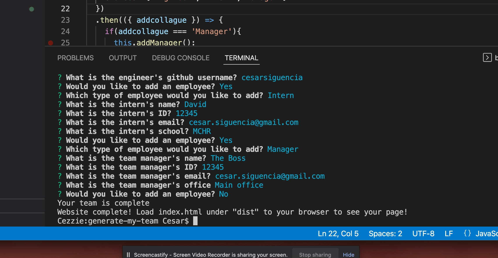
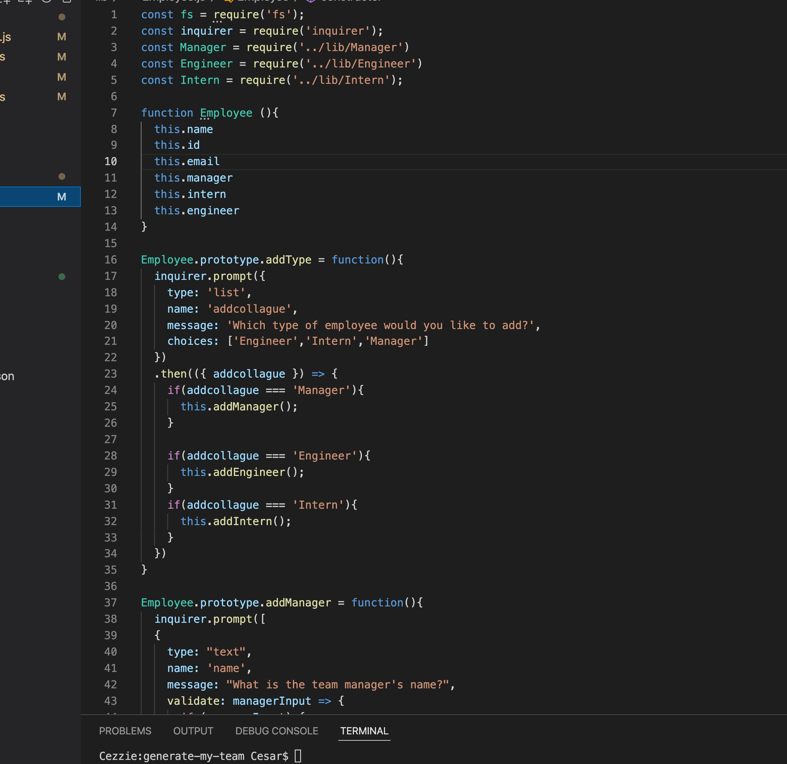

# Welcome to my Teams and Collagues Website Generator

### Description
This app is a command-line program used to create a simple website outlining all members of your workplace team, including a manager, engineers, interns, and other employees. The user will be asked a series of questions relating to each individual employee, such as name, email, and office. 

To start the program, download this repository and check in to the local in the command-line. Type 'node index' to run program.

### Walkthrough Video
[Link to Tutorial](https://drive.google.com/file/d/1NSfsrCPQzf_Seb8vvm16_d_FFySruOGt/view?usp=sharing)

### Screenshots

